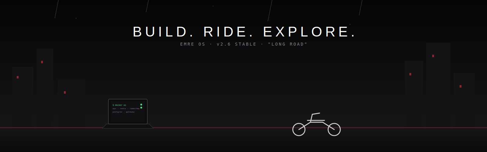
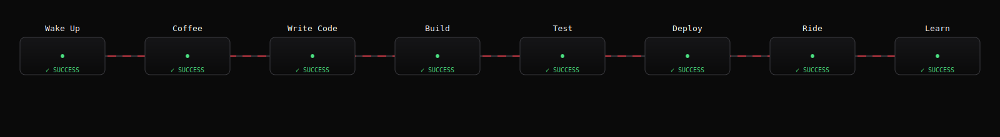

 

 

## `$ ssh github.com/emrecinar`

<!--
      .--.
     / o_o \      root: some systems are just built to keep running.
     \_-_-_/
-->

 

## `visitor@github:~$ whoami`

 

## System Status

| Service | State |
|---|---|
| `identity.service` |  |
| `coffee.service` |  |
| `learning.service` |  |
| `architecture.service` |  |
| `garage.service` |  |
| `music.service` |  |

 

## `visitor@github:~$ docker ps`

## `visitor@github:~$ kubectl get pods -n broadcast`

 

## Mission Control

`visitor@github:~$ kubectl get deployments`

 

## Deployment Pipeline

 

## Telemetry

`CPU → architecture` · `Memory → knowledge` · `Threads → projects` · `Network → open source`

 

## `visitor@github:~$ spotify now-playing`

 

## `visitor@github:~$ garage status`
## `visitor@github:~$ gallery --tags`

 

## `visitor@github:~$ shutdown -r "see you on the road"`

  

  

